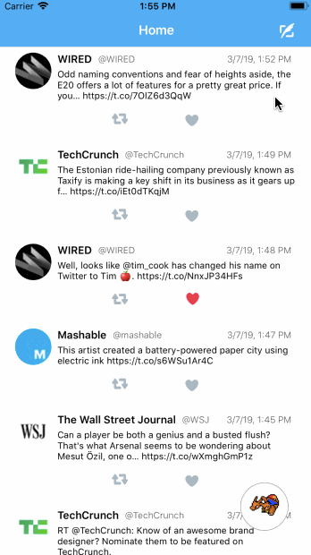
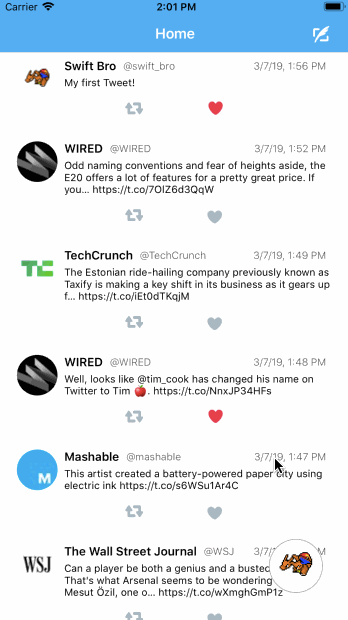
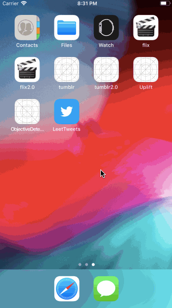
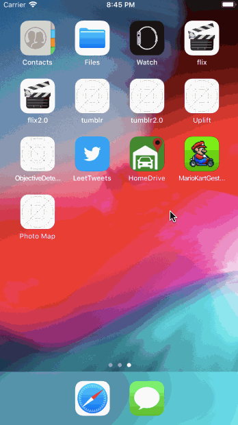
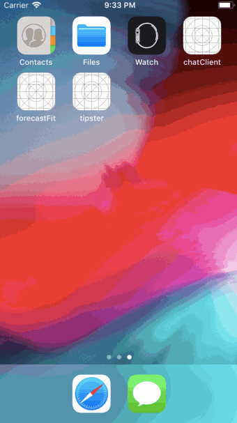
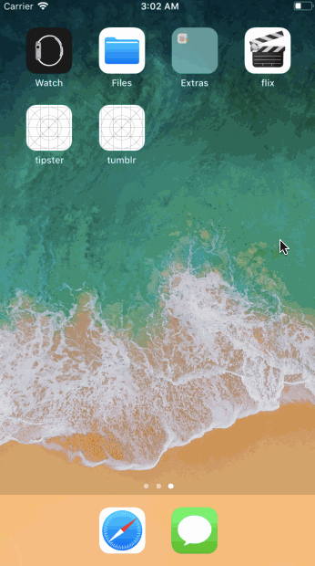
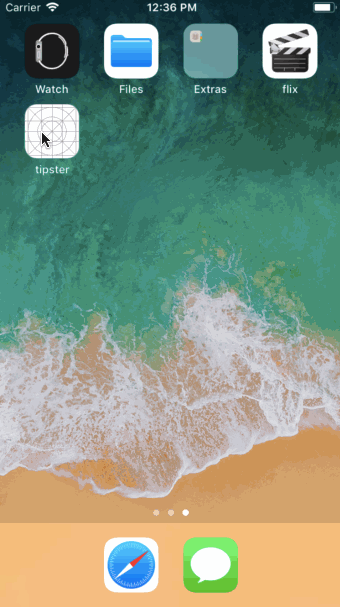
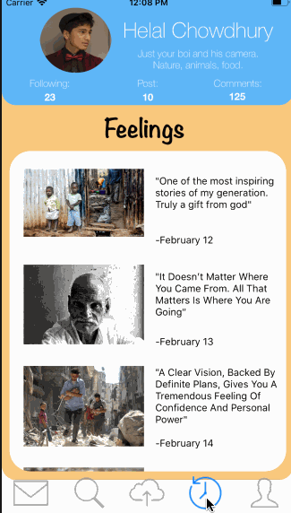

# Master List

This repository serves to be a quick overview for all of my iOS projects, all in one place.

**Table of Contents**
- [Personal iOS Projects](https://github.com/matthewbrod01/iOS-Projects-Master-List#personal-ios-projects)
- [Hackathon Projects](https://github.com/matthewbrod01/iOS-Projects-Master-List#hackathon-projects)

# Personal iOS Projects

## TwitterClone
- *Description:* TwitterClone-like app that allows users to post tweets to a real-time feed

- *Features:* TwitterAPI, UITableView, ContainerView, SideMenu Pod, OAuth, Segues, AutoLayout, UIAlertControllers

- *Takeaways:* Practiced UI Design by using 3rd party libraries (SideMenu), alert controllers, AutoLayout. Learned to work with API Calls. Tinkered with "Sticky" UIButtons overlay-ed on top of other view controllers.

[Repo link](https://github.com/matthewbrod01/twitterClone)

## HomeDrive
- *Description:* Incomplete iOS Project. Prototyping an idea that will allow drivers to connect with homeowners for renting out private parking spaces.

- *Features:* Google OAuth, Google Maps, FloatingPanelController

- *Takeaways:* Practiced UI Design. Learned to work with FloatingPanel (3rd party library). Implemented Google's Sign-In, Google Maps.

- *To Be Added:* Firebase Database, HomeOwner UI Screen, Booking functionality

[Repo link To Be Added When Complete]()

## InstagramClone
- *Description:* Instagram-like app that allows users to post images and captions to a real-time feed

- *Features:* OAuth, Parse Backend, UIImagePickerController Camera

- *Takeaways:* Learned user authentication, Parse Backend for storing and downloading data in real-time, Using iOS Camera to take photos and videos

[Repo link](https://github.com/matthewbrod01/Instagram-Clone)

## ParseChat
- *Description:* Short app project to learn about parse backend. Created a chat messaging client.

- *Features:* OAuth, Parse Backend, Local data persistence

- *Takeaways:* Learned user authentication, working with a database to send and retrieve data

[Repo link](https://github.com/matthewbrod01/chatClient)

## Tumblr
- *Description:* Tumblr Client that shows stories from Humans of New York

- *Features:* TumblrAPI, Segues, UITableViewHeaders, UIScrollView, InfiniteScroll

- *Takeaways:* Further practiced working with table views. Learned how to pass data between screens. Worked with UIScrollView for image zoom and infinite scrolling

[Repo link](https://github.com/matthewbrod01/tumblr2.0)

## Flix
- *Description:* Uses MovieDB API to browse movies

- *Features:* UITableView, UICollectionView, AlamofireImage, PKHUD, Network Requests, WKWebView

- *Takeaways:* Learned Table Views, Collection Views, Cocoapods Integration, Network Request Calls, Parsing JSON files, Implementing youtube trailer videos

[Repo link](https://github.com/matthewbrod01/flix2.0)

## Tipster
- *Description:* First iOS Project. Created a Tipping Calculator.

- *Features:* UITextField, UIButton, Navigation Controller, Segues

- *Takeaways:* Storyboard Interface Objects, Xcode basics

[Repo link](https://github.com/matthewbrod01/tipster)

 

# Hackathon projects

## Uplift
- *Description:* HackNYU, Feb 2019. Social Media Hack.

- *Features:* Firebase Real-time Database, Firebase Storage, AVKit Camera

- *Takeaways:* Further experimented with Firebase for backend (Uploading and Downloading Videos to real-time feed)

[Repo link](https://github.com/matthewbrod01/Uplift)

## ForecastFit
- *Description:* First Hackathon attended (HackCooper, Oct 2018). Created an iOS app that suggests outfits to users based on weather forecasts. **Won most innovative hack out of 40 teams**

- *Features:* UIImagePickerController (Camera Functionality), Yahoo Weather API, Firebase Backend

- *Takeaways:* Learned how to work with iOS Camera, first time playing with Firebase Database

[Repo link](https://github.com/matthewbrod01/forecastFit)

